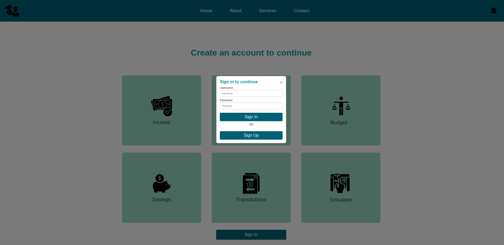
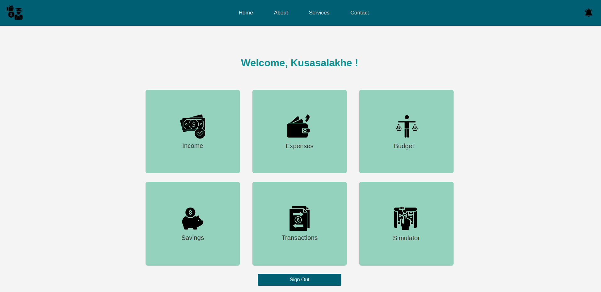
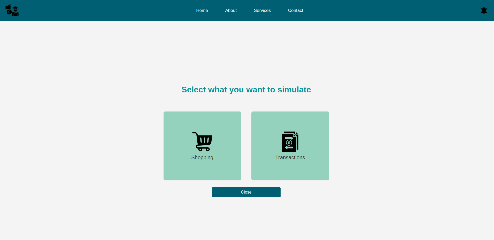
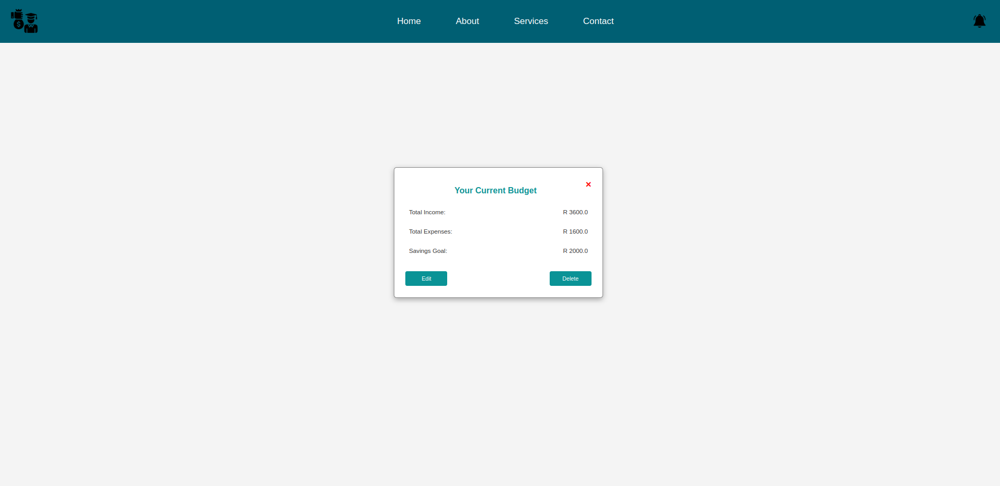
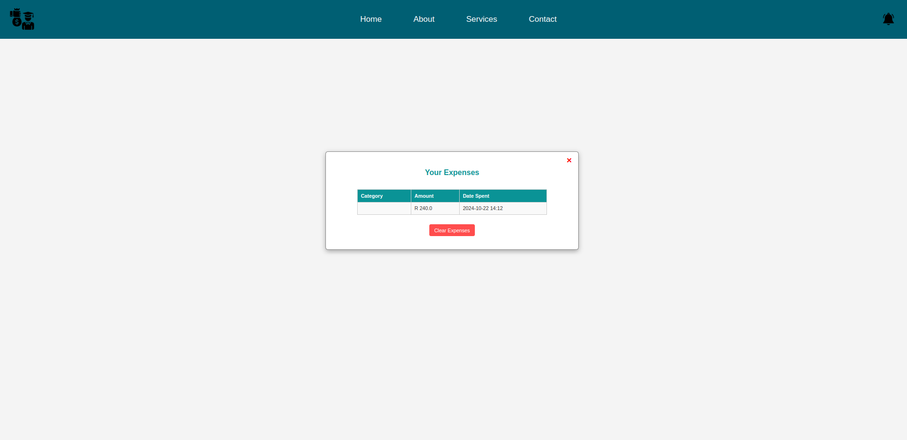

# UniSave (in progress)

**UniSave** is a financial management tool designed to help students manage their money effectively. With UniSave, 
students can simulate expenses, set up budgets, track transactions, monitor savings, and manage income sources — all in one place.

## Table of Contents
- [About the Project](#about-the-project)
- [Features](#features)
- [Built With](#built-with)
- [Getting Started](#getting-started)
- [Usage](#usage)
- [Screenshots](#screenshots)
- [Contributing](#contributing)
- [Contact](#contact)

## About the Project

UniSave was created to support students in developing healthy financial habits by offering an intuitive platform where they can manage 
and visualize their money. It includes tools like budget planning, spending simulations, transaction tracking, and savings goals, helping 
students make informed financial decisions.

## Features

- **Simulator**: A tool that allows students to simulate spending on various expenses before making real financial decisions.
- **Budget**: Students can set up monthly or weekly budgets to monitor their spending and prevent overspending.
- **Expenses**: Tracks all user expenses, categorizing them to provide a clear view of where money is going.
- **Transactions**: Provides a transaction history where users can view all their past transactions.
- **Savings**: Allows students to set up savings goals and track their progress.
- **Income**: Enables users to log and manage multiple sources of income.

## Built With

- **Django**: Backend framework for server-side logic
- **HTML/CSS/JavaScript**: Frontend languages for building the user interface
- **SQLite**: Default database for development (can be replaced with PostgreSQL or MySQL for production)

## Getting Started

To set up UniSave locally, follow these steps:

### Prerequisites

- Python 3.x
- Django
- Node.js and npm (optional, for managing frontend dependencies)

### Installation

1. **Clone the repository**:
   ```bash
   https://github.com/khlongwa-code/university-savings.git
   cd UniSave

2. **Create and activate a virtual environment**:
    ```bash
    python -m venv env
    source env/bin/activate

3. **Install dependencies**:
   ```bash
   pip install -r requirements.txt

4. **Apply migrations**:
   ```bash
   python manage.py migrate

5. **Create a superuser**(optional, for accessing the admin panel):
   ```bash
   python manage.py createsuperuser

6. **Start the development server**:
   ```bash
   python manage.py runserver

7. **Access UniSave**:

    Open http://127.0.0.1:8000 in your web browser.

## Usage

Once UniSave is running, users can access the following modules after creating an account:

- **Simulator**: Navigate to the Simulator tab to experiment with different spending scenarios.
- **Budget**: Go to the Budget section to set up and adjust monthly or weekly budget limits.
- **Expenses**: Check the Expenses page to view categorized expenses.
- **Transactions**: View the Transactions page to see a history of all transactions.
- **Savings**: In the Savings section, set up and track progress toward your savings goals.
- **Income**: Visit the Income tab to add or update income sources and view your overall income.

## Screenshot

*UniSave landing page*



*UniSave's main dashboard with easy access to all financial tools.*



*Spending simulator for users to plan out their expenses.*



*Budget management interface.*



*Expense management interface.*



## Contributing

Contributions are welcome to help improve UniSave! To contribute:

1. Fork the project

2. Create a feature branch (git checkout -b feature/NewFeature)

3. Commit your changes (git commit -m 'Add new feature')

4. Push to the branch (git push origin feature/NewFeature)

5. Open a pull request

## Contact

Developed by **Kusasalakhe Hlongwa** - **ayandahlongwa21@gmail.com**

Project link: https://github.com/khlongwa-code/university-savings
